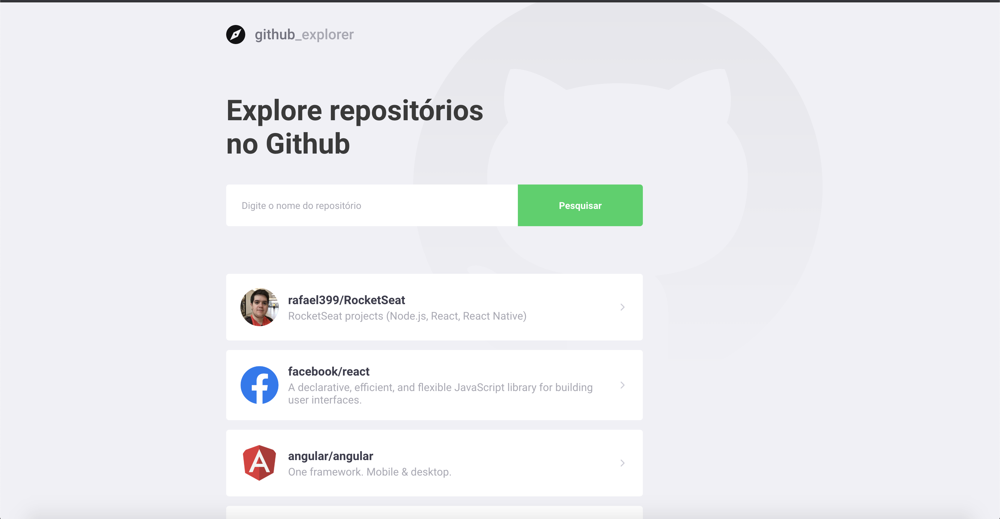
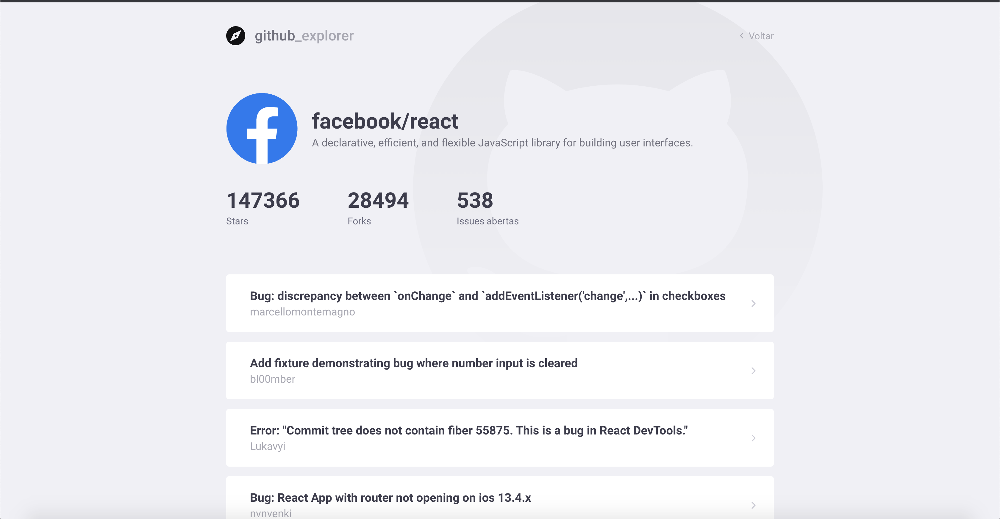

## :question: Sobre

* Website desenvolvido durante o módulo 'Primeiro projeto com React' no GoStack Bootcamp da **[Rocketseat](https://rocketseat.com.br/)** *

Aplicação web desenvolvida com ReactJS que busca repositórios do Github através da api do Github e guarda esses repositórios no local storage do navegador.
Os repositórios são listados na página com avatar, título e descrição e também é possível clicar no repositório para ver mais detalhes como número de `stars`, número de `forks`, número de `issues abertas` e também a lista das `issues`

## :question: Como rodar a aplicação

- Clonar repositório
- Rodar o comando `yarn` para fazer a instalação das dependencias
- Rode a aplicação com o comando `yarn start`
- Adicione repositórios digitando o nome do autor/repositório no campo de texto (exemplo: `facebook/react`) e apertando `enter` ou clicando no botão 'Pesquisar'
- Caso queira, clique em um dos repositórios listados para ver mais detalhes sobre ele

## :camera:

Format: 

Format: 
